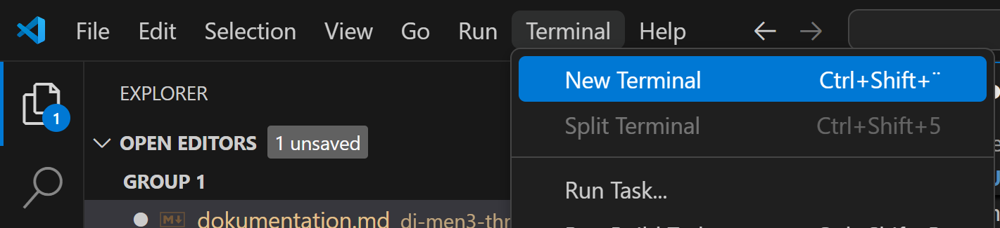
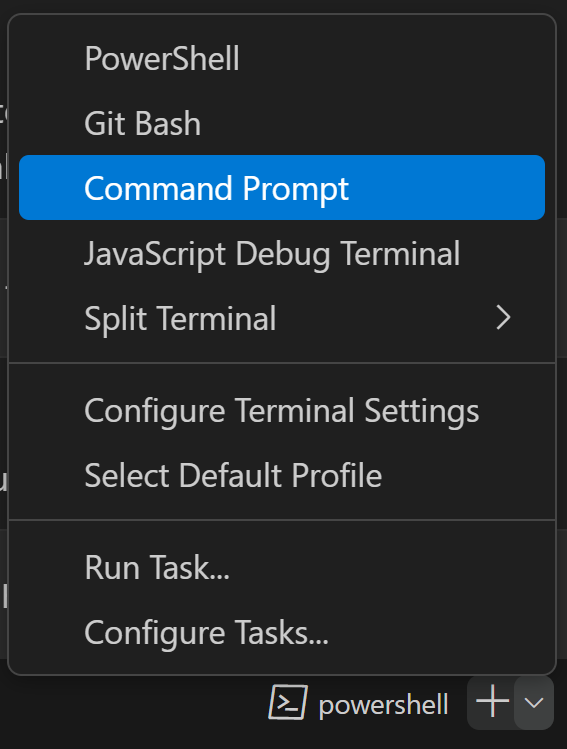
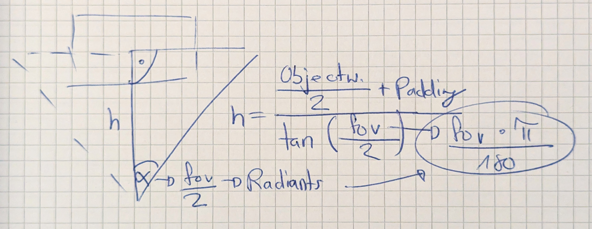
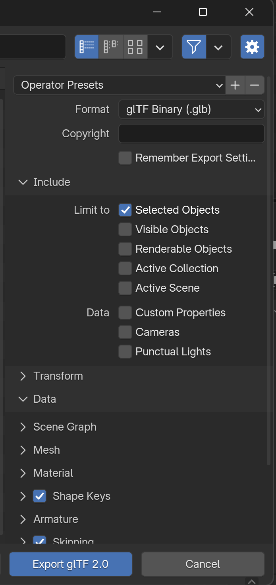
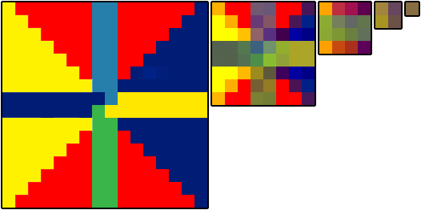

# 1. Introduction

This documentation provides a comprehensive guide to getting started with Three.js. It offers code snippets for the basic structure of a Three.js application, covering essential components like scenes, cameras, renderers, and objects. Additionally, it dives into specific features and techniques.

# 2. Table of Content

- [1. Introduction](#1-introduction)
- [2. Table of Content](#2-table-of-content)
- [3. Setting Up the Development Environment for Three.js](#3-setting-up-the-development-environment-for-threejs)
  - [3.1. Step-by-Step Installation](#31-step-by-step-installation)
  - [3.2. Important Commands](#32-important-commands)
- [4. Linking Project Files](#4-linking-project-files)
  - [4.1. HTML](#41-html)
  - [4.2. Javascript](#42-javascript)
  - [4.3. SASS](#43-sass)
- [5. Create Code Exclusively for Development Hidden in the Final Build](#5-create-code-exclusively-for-development-hidden-in-the-final-build)
- [6. Basic Structure of a Minimal Three.js File](#6-basic-structure-of-a-minimal-threejs-file)
  - [6.1. Import](#61-import)
  - [6.2. Fallback / WebGL compatibility check](#62-fallback--webgl-compatibility-check)
  - [6.3. Scene](#63-scene)
  - [6.4. Camera](#64-camera)
  - [6.5. Objects](#65-objects)
  - [6.6. Renderer](#66-renderer)
  - [6.7. Base Code](#67-base-code)
- [7. Nesting](#7-nesting)
  - [7.1. Supported Nestable Objects](#71-supported-nestable-objects)
  - [7.2. Passed Properties](#72-passed-properties)
  - [7.3. Example of Adding a Base Object and a Nested Object](#73-example-of-adding-a-base-object-and-a-nested-object)
  - [7.4. Bypassing Inheritance](#74-bypassing-inheritance)
- [8. lil-gui (brwoser controls)](#8-lil-gui-brwoser-controls)
  - [8.1. Create fields](#81-create-fields)
  - [8.2. Include logic](#82-include-logic)
  - [8.3. Nested controllers](#83-nested-controllers)
- [9. Responsive Canvas](#9-responsive-canvas)
  - [9.1. Canvas Handling](#91-canvas-handling)
  - [9.2. Positioning the Camera to Keep the Object Fully Visible with Fixed Padding](#92-positioning-the-camera-to-keep-the-object-fully-visible-with-fixed-padding)
- [10. Orbit, Pan \& Zoom](#10-orbit-pan--zoom)
  - [10.1. Disable functions](#101-disable-functions)
  - [10.2. Set Limits](#102-set-limits)
  - [10.3. Damping](#103-damping)
- [11. Load GLTF File](#11-load-gltf-file)
  - [11.1. Copying models](#111-copying-models)
- [12. Materials](#12-materials)
  - [12.1. Requirements](#121-requirements)
  - [12.2. Comparison](#122-comparison)
  - [12.3. General Settings](#123-general-settings)
    - [12.3.1. Shading](#1231-shading)
    - [12.3.2. Culling (Back-face culling)](#1232-culling-back-face-culling)
  - [12.4. Update Material](#124-update-material)
- [13. Load Textures](#13-load-textures)
  - [13.1. Load Texturemaps (jpg, png, etc.)](#131-load-texturemaps-jpg-png-etc)
  - [13.2. Texture Settings](#132-texture-settings)
    - [13.2.1. UV Maps](#1321-uv-maps)
    - [13.2.2. Magnification \& Minification](#1322-magnification--minification)
    - [13.2.3. Types](#1323-types)
    - [13.2.4. Formats](#1324-formats)
    - [13.2.5. Color Space](#1325-color-space)
    - [13.2.6. Compression](#1326-compression)
    - [13.2.7. LoadingManager](#1327-loadingmanager)
- [14. Animations](#14-animations)
  - [14.1. Quick overview](#141-quick-overview)
  - [14.2. Loaders](#142-loaders)
  - [14.3. Animation Clips](#143-animation-clips)
  - [14.4. Keyframe Tracks](#144-keyframe-tracks)
  - [14.5. Animation Mixer](#145-animation-mixer)
  - [14.6. Animation Action](#146-animation-action)
  - [14.7. Animation Object Groups](#147-animation-object-groups)
- [15. Lighting](#15-lighting)
  - [15.1. Shadows](#151-shadows)
    - [15.1.1. Renderer](#1511-renderer)
    - [15.1.2. Light Sources](#1512-light-sources)
    - [15.1.3. Objects](#1513-objects)
  - [15.2. Lights](#152-lights)
  - [15.3. environment map](#153-environment-map)
- [16. Todo Pages](#16-todo-pages)

# 3. Setting Up the Development Environment for Three.js

Before warking with three.js, I set up my developing environment. I used the recommended enviroment with the installation trough NPM and vite as the build tool, roughly described in the [three.js manual](https://threejs.org/docs/index.html#manual/en/introduction/Installation).

Before working with Three.js, it’s essential to set up a development environment that ensures a smooth workflow. The recommended approach is to use [NPM](https://www.npmjs.com/) for package management and [Vite](https://vitejs.dev/) as the build tool. This setup is outlined in the [Three.js manual](https://threejs.org/docs/index.html#manual/en/introduction/Installation). Follow the steps below to get started:

## 3.1. Step-by-Step Installation

1. **Install Node.js**

   Node.js comes with NPM (Node Package Manager) which is used to install, update and manage the pakages. It also create a "package.json" file that lists all used packages. With this file you can easily install the packages on another machine.

   - Download and install Node.js from the [official website](https://nodejs.org/).

2. **Create a New Project Directory**

   Create a New Project Directory.

3. **Open Terminal in IDE**

   - Open VS Code (or prefferd IDE) and its Terminal:
     
   - If wanted, change the terminal to "Command Prompt":
     
   - Navigate to the Project Directory.

     ```bash
     # Enter folder (autocomplete with "Tab"):
     cd di-men3-three.js

     # Leave folder:
     cd ..
     ```

4. **Install Three.js & Vite**

   Run follwoing commands in the Terminal to install the packages for Three.js and Vite:

   ```bash
   npm install --save three
   npm install --save-dev vite

   # optinally install SASS
   npm install -D sass

   # check installed packages
   npm list
   ```

5. **Configure Vite**

   Add a `vite.config.js` file to the root of your project and paste following code into it. The code defines to use [relativ path](https://vite.dev/guide/build.html#relative-base) with `base: ''` and adds [multiple enterypoints](https://vite.dev/guide/build.html#multi-page-app). For exaple `main: resolve(__dirname, 'index.html')`.

   ```bash
   import { resolve } from 'path';
   import { defineConfig } from 'vite';

   export default defineConfig({
     base: '',
     build: {
       rollupOptions: {
         input: {
           main: resolve(__dirname, 'index.html'),
           setup: resolve(__dirname, 'src/01_setup/setup.html'),
           line: resolve(__dirname, 'src/02_line/index.html'),
         }
       }
     }
   });
   ```

6. **Create Development Directory**

   In the Project direcory add one named "src" for all files.
   In this folder you can create an `index.html`, `style.css` and `main.js`. the main.js is nececarry for Three.js.

7. **Run and Build the Website**

    To see the index.html Page, you need to run the Vite Server. You also need to Build the Files to run idependent of the Server. The necessary commands are listed in the following capter.

## 3.2. Important Commands

- Move in the directory:

  ```bash
  # Enter folder (autocomplete with "Tab"):
  cd di-men3-three.js

  # Leave folder:
  cd ..
  ```

- Run Vite Develepment Server:

  ```bash
  npx vite dev
  ```

  [View page on `http://localhost:5173`](http://localhost:5173)

- Stop Vite Develepment Server:
  ```bash
  #Press Ctrl + C
  ```
- Build Page:
  ```bash
  npx vite build
  ```

# 4. Linking Project Files  
For a basic website, you need an `index.html`, `main.js`, and `style.css`.

## 4.1. HTML  
The HTML is structured normally with a link to the `main.js` file. If you link a CSS file directly, it should also be included. When using SASS, there’s no need to link the SASS file in the HTML, as you link it in the main.js.

```html
<!DOCTYPE html>
<html lang="en">
<head>
    <meta charset="UTF-8">
    <meta name="viewport" content="width=device-width, initial-scale=1.0">
    <title>title</title>

    <!-- optioanal css link -->
    <link rel="stylesheet" href="style.css">

</head>
<body>
    <!-- js link -->
    <script type="module" src="main.js"></script>

</body>
</html>
```

## 4.2. Javascript
At the top of the JavaScript file, you import the SASS file:
```javascript
import '/style.scss';
```

## 4.3. SASS  
With Vite (if SASS is installed), no additional configuration is needed for SASS to work. However, the SASS file must be imported in the `main.js` file, as shown in the JavaScript section.

# 5. Create Code Exclusively for Development Hidden in the Final Build
To include code in the development environment that is excluded from the final build, you can use the following `if` statement:

```javascript
if (import.meta.env.DEV) {
  // Code to execute
}
```
In HTML, it can look like this:
```html
<script type="module">
  if (import.meta.env.DEV) {
    document.body.insertAdjacentHTML(
      'beforeend', // Options: 'beforebegin', 'afterbegin', 'beforeend', 'afterend'
      '<div id="dev-block"></div>'
    );
  }
</script>
```

# 6. Basic Structure of a Minimal Three.js File

This chapter outlines the fundamental components of a Three.js file. Using this code, you can display 3D objects on a website.

At the end of this chapter, you’ll find the complete base code for quick reference and copy-paste use.

## 6.1. Import

To use Three.js, import the necessary modules at the top of your file.

While Three.js offers the essential tools for 3D graphics, additional features such as controls, loaders, and effects are included in the addons directory. These addons do not require separate installation but must be explicitly imported when needed.

```javascript
import * as THREE from "three";
// Additional modules can be imported here
```

## 6.2. Fallback / WebGL compatibility check

Although rare, some devices or browsers may not support WebGL 2. Implementing a fallback ensures a better user experience.

```javascript
import WebGL from "three/addons/capabilities/WebGL.js";

if (!WebGL.isWebGL2Available()) {
  const warning = WebGL.getWebGL2ErrorMessage();
  document.body.appendChild(warning);
} else {
  createScene();
}
```

## 6.3. Scene

The scene acts as a container for all the objects, lights, and cameras.


[Image Source: threejs.org](https://threejs.org/manual/#en/fundamentals)

```javascript
const scene = new THREE.Scene();
```

## 6.4. Camera

The `PerspectiveCamera` is commonly used for 3D scenes.
There are two types:

- [PerspectiveCamera](https://threejs.org/docs/index.html#api/en/cameras/PerspectiveCamera)
- [OrthographicCamera](https://threejs.org/docs/index.html#api/en/cameras/OrthographicCamera)

```javascript
const camera = new THREE.PerspectiveCamera(
  75, // Field of view in degrees
  window.innerWidth / window.innerHeight, // Aspect ratio
  0.1, // Near clipping plane
  1000 // Far clipping plane
);
camera.position.z = 5; // Move the camera away from the origin
```

## 6.5. Objects

To display something in the scene, you need to add a 3D object. You can add your own or load a [primitive](https://threejs.org/manual/#en/primitives).

Remember the structure of an object: it requires geometry and material (or texture), both combined into a new mesh.

```javascript
// Object
// ├── Geometry (defines the shape)
// └── Material (defines the surface appearance)

const geometry = new THREE.BoxGeometry(); // Define the shape
const material = new THREE.MeshBasicMaterial({ color: 0x00ff00 }); // Define the surface appearance
const cube = new THREE.Mesh(geometry, material); // Combine shape and material
scene.add(cube); // Add the cube to the scene
```

## 6.6. Renderer

And finally, the renderer is responsible for rendering the scene and camera onto the screen. The `WebGLRenderer` is the default and most widely used renderer in Three.js.

```javascript
const renderer = new THREE.WebGLRenderer();
renderer.setSize(window.innerWidth, window.innerHeight); // Match the screen size
document.body.appendChild(renderer.domElement); // Attach the canvas to the document

// Later you render the Scene. If there is not only a still image, you have to create a loop
renderer.render(scene, camera); // Render the scene from the camera's perspective
```

## 6.7. Base Code

Below is the complete base code, combining all the steps above into a functional Three.js setup.

```javascript
import * as THREE from "three";
import WebGL from "three/addons/capabilities/WebGL.js";

if (!WebGL.isWebGL2Available()) {
  const warning = WebGL.getWebGL2ErrorMessage();
  document.body.appendChild(warning);
} else {
  createScene();
}

function createScene() {
  const scene = new THREE.Scene();
  const camera = new THREE.PerspectiveCamera(
    75,
    window.innerWidth / window.innerHeight,
    0.1,
    1000
  );

  const renderer = new THREE.WebGLRenderer();
  renderer.setSize(window.innerWidth, window.innerHeight);
  renderer.setAnimationLoop(animate);
  document.body.appendChild(renderer.domElement);

  const geometry = new THREE.BoxGeometry(1, 1, 1);
  const material = new THREE.MeshBasicMaterial({ color: 0x999999 });
  const cube = new THREE.Mesh(geometry, material);
  scene.add(cube);

  camera.position.z = 5;

  function animate() {
    cube.rotation.x += 0.01;
    cube.rotation.y += 0.01;

    renderer.render(scene, camera);
  }
}
```

# 7. Nesting
Nesting in Three.js allows you to group objects under a parent, simplifying the management of complex structures. When a parent object is transformed (position, rotation, scale), its child objects inherit those transformations.

## 7.1. Supported Nestable Objects
You can nest any Three.js object, including:
- Meshes
- Groups
- Cameras
- Lights
- Helpers
- Custom Objects

## 7.2. Passed Properties
- **Position**: Child positions are relative to the parent.
- **Rotation**: Child rotations are combined with the parent's.
- **Scale**: Parent scale applies proportionally to children.

This means changes to the parent automatically propagate to the children.

## 7.3. Example of Adding a Base Object and a Nested Object
```javascript
const parent = new THREE.Mesh(
  new THREE.BoxGeometry(2, 2, 2),
  new THREE.MeshBasicMaterial({ color: 0xff0000 })
);
const child = new THREE.Mesh(
  new THREE.BoxGeometry(1, 1, 1),
  new THREE.MeshBasicMaterial({ color: 0x00ff00 })
);

scene.add(parent); // Add parent at root
parent.add(child); // Nest child under parent
child.position.set(1, 1, 0); // Position relative to parent
```

## 7.4. Bypassing Inheritance
If you need to bypass these transformations and set a child’s position in world space, you can detach it temporarily or transform the world position to the parent’s local space:

```javascript
// Set child position based on world coordinates
const targetWorldPosition = new THREE.Vector3(3, 2, 5);
const localPosition = parent.worldToLocal(targetWorldPosition.clone());
child.position.copy(localPosition);
```

Or, temporarily detach to set world position directly:

```javascript
scene.attach(child); // Temporarily remove from parent
child.position.set(3, 2, 5); // Set world position
parent.attach(child); // Reattach to parent
```

After reattaching, the child will retain its visual position but its coordinates will update to match the parent’s local space. This behavior ensures a consistent relationship in the hierarchy.

# 8. lil-gui (brwoser controls)
[lil-gui](https://lil-gui.georgealways.com/) is a lightweight library for adding interactive controls to your project. It’s perfect for quickly tweaking parameters in real-time, making it ideal for debugging, prototyping, and creative coding. 

You can simply load it as an addon:
```javascript
import { GUI } from 'three/addons/libs/lil-gui.module.min.js';
```

After loading the addon, you can create a gui:
```javascript
const gui = new GUI();

// optionally add a title
gui.title('GUI-Title')
```

## 8.1. Create fields
Either define the varibales before adding them, often stored in an object:
```javascript
const settings = {
  setting1: "string",
  setting2: bool,
  setting3: 10
}

gui.add(settings, 'setting1');
gui.add(settings, 'setting2').name('Bool Flag'); // include name
gui.add(settings, 'setting3', 1 , 100, 1); // include min, max and steps

// use settings
let string: settings.setting1;
let bool: settings.setting2;
let value: settings.setting3;
```

Or modify directly in the gui:
```javascript
gui.add(camera.position, 'z', 1, 10).name('Camera Distance');
```

## 8.2. Include logic
Since changing the variables doesn't directly modify your 3D objects, you can incorporate additional logic:
```javascript
// insert code
gui.add(settings, 'brightness', 0, 100).name('Brightness').onFinishChange( value => {
	console.log( value );
});
// call function
gui.add(settings, 'numCubes', 1, 100, 1).name('Number of Cubes').onChange(resetCubes);
// on all changes
gui.onChange( event => {
  // readables:
	event.object     // object that was modified
	event.property   // string, name of property
	event.value      // new value of controller
	event.controller // controller that was modified

  console.log(event.object);
});
```

## 8.3. Nested controllers
Organize controllers with nested structures for better clarity. This is done using folders:
```javascript
// add folder to gui
const folder = gui.addFolder( 'Nested Settings' );
// add setting to folder
folder.add(nestedSettings, 'setting');
```

# 9. Responsive Canvas
A canvas has two sizes: its visible display size on the page and its internal pixel resolution. To maintain responsiveness, both sizes must be set and updated accordingly. Additionally, you can adjust the camera distance for fixed elements.

## 9.1. Canvas Handling
Ideally, you should create and style the canvas using HTML and CSS.
```html
<canvas id="canvas"></canvas>
<style>
  #canvas {
    height: 100vh;
    width: 100%;
    /* display block is important to eliminate the white border */
    display: block;
  }
</style>
```
In a function, both sizes are reset based on the canvas display size. In the main function, you add an event listener for the `resize` event and also call the function once during the initial load. (If you start and stop rendering, you may also add and remove the event listener to improve performance.)

Within the function, you read the new display size and set it as the render size (internal pixel resolution). Additionally, set the canvas `width` and `height` attributes to ensure the resolution matches the actual display size. Finally, correct the aspect ratio to eliminate any distortion.

Retina displays often create a mismatch between physical and browser-reported pixel sizes. This issue can be resolved for sharper renders at the cost of performance.

**Standard Calculation without Extra Resolution for Retina Displays**
```javascript
// Handle resizing of the window
window.addEventListener('resize', onResize, false);
onResize();

function onResize() {
  const width = canvas.clientWidth;
  const height = canvas.clientHeight;

  // Set renderer size and adjust canvas attributes
  renderer.setSize(width, height, false);
  canvas.width = width;
  canvas.height = height;

  // Update camera aspect ratio and projection matrix
  camera.aspect = canvas.clientWidth / canvas.clientHeight;
}
``` 

**Enhanced resolution based on the device's actual pixel ratio, limited to 2x for performance reasons.**
```javascript
// Handle resizing of the window
window.addEventListener('resize', onResize, false);
onResize();

function onResize() {
  const pixelRatio = Math.min(window.devicePixelRatio, 2); // Limit to 2x for performance
  const width = Math.round(canvas.clientWidth * pixelRatio);
  const height = Math.round(canvas.clientHeight * pixelRatio);

  // Set renderer size and adjust canvas attributes
  renderer.setSize(width, height, false);
  canvas.width = width;
  canvas.height = height;

  // Update camera aspect ratio and projection matrix
  camera.aspect = canvas.clientWidth / canvas.clientHeight;
}
``` 

## 9.2. Positioning the Camera to Keep the Object Fully Visible with Fixed Padding
Due to the manual definition of object size and padding, this solution is not recommended for pages with zoomable websites.

During window resizing, the camera’s Z position is also adjusted to ensure the object remains visible with the correct padding. This adjustment is based on the camera’s FOV and the aspect ratio of the viewport. Before performing the calculation, you need to define the object's `width`, `height`, and `padding` to ensure accurate results.

```javascript
const objectWidth = 1;
const objectHeight = 1;
const padding = 1;
```

To start, ignore the aspect ratio and calculate the distance using only the FOV, object size, and padding. This is done with a tangent calculation. (Technically, this calculates the distance for an aspect ratio of 1, which corresponds to a square viewport.)



You halve the FOV to form a right triangle. With this, you can now calculate the height:

$$
\text{height} = \tan\left(\frac{\text{length of the opposite side}}{\text{FOV angle}}\right)
$$

- To calculate the FOV angle, first convert the FOV from degrees to radians and then halve it:

$$
\text{FOV angle (radians)} = \frac{\frac{\text{FOV (degrees)} \times \pi}{180}}{2}
$$

- For the opposite side, take half of the object's width or height and add the padding. To ensure the object fits in the viewport, use the width if the aspect ratio is portrait, and the height if the aspect ratio is landscape:

$$
\text{Opposite side} = \frac{\text{Object width or height}}{2} + \text{Padding}
$$

After the calculation, simply divide the result by the aspect ratio when the browser is in portrait mode to adjust for the aspect ratio.

**In code, this looks like this:**

You can use a separate function to handle the camera movement, which is called from within the resize function. With high FOV values, the camera may move very close to the object in order to spread, for example, a 180° view across the screen. To prevent the camera from intersecting with the object, there is a minimum distance value of 1.

```javascript
function onResize() {
  adjustCameraToObject();
}

function adjustCameraToObject() {
  // set dimensions and padding
  const objectWidth = 1;
  const objectHeight = 1;
  const padding = 1;
  // get new camera aspect ratio
  const aspectRatio = camera.aspect;
  // get camera fov in radiants
  const fov = camera.fov * (Math.PI / 180);
  // initialize distance to use later on
  let distance;

  if (aspectRatio > 1) { // Landscape mode
      // calculate distance with height and set min to 1
      distance = Math.max((objectHeight / 2 + padding) / Math.tan(fov / 2), 1);
  } else { // Portrait mode
      // calculate distance with width and set min to 1
      distance = Math.max((objectWidth / 2 + padding) / Math.tan(fov / 2) / aspectRatio, 1);
  }
  camera.position.z = distance;
}
```

# 10. Orbit, Pan & Zoom
The [OrbitControls library](https://threejs.org/docs/index.html#examples/en/controls/OrbitControls) provides an easy way to orbit, pan, and zoom the camera using mouse or touch input.

``` javascript
import { OrbitControls } from 'three/addons/controls/OrbitControls.js';
```

Since these controls manipulate the camera, when created, the controller is automatically bound to the camera. For the listeners to work properly, it's necessary to link the canvas to the controls. Additionally, you can optionally listen for window-level inputs, such as resizing or key presses, to ensure the camera and controls behave correctly across various events.

``` javascript
const controls = new OrbitControls(camera, renderer.domElement);
controls.listenToKeyEvents( window );
```

When the user interacts with the camera through touch, the camera updates automatically. However, if you are animating or updating the camera (for example, with damping, smooth zoom, or auto-rotation) without direct user input, you must explicitly call the `controls.update()` function within the animation loop to ensure the camera's position and orientation are properly updated.

``` javascript
renderer.setAnimationLoop(render);
function render() {
    controls.update(); // controls update function
    renderer.render(scene, camera);
}
```

## 10.1. Disable functions
Out of the box, orbit, pan, and zoom are enabled. You can easily disable them by:

``` javascript
controls.enableRotate = false; // Disable rotation
controls.enableZoom = false;   // Disable zooming
controls.enablePan = false;    // Disable panning
```

## 10.2. Set Limits
For all the settings, you can set limits such as:

``` javascript
controls.maxDistance = 100;           // Limit the zoom out distance
controls.minDistance = 1;             // Limit the zoom in distance
controls.maxPolarAngle = Math.PI / 2; // Limit the vertical rotation (no flipping)
```

## 10.3. Damping
For a smoother orbit and pan, it is recommended to set this setting to `true`. Additionally, it's important to update the camera controls every frame to account for the post-touch smoothing.

``` javascript
controls.enableDamping = true; // Smooths the movement
controls.dampingFactor = 0.05; // The damping speed (default: 0.05)

// controls.update();
renderer.setAnimationLoop(render);
function render() {
    controls.update();
    renderer.render(scene, camera);
}
```

# 11. Load GLTF File
To load a custom 3D model, use a `.glb` or `.gltf` file. A `.glb` file contains all assets, like UV maps and textures, in one file. In contrast, a `.gltf` file stores the model separately, along with additional `.bin` and texture files. For simplicity, using a `.glb` file is recommended.

Export your model from Blender via `Export > glTF 2.0`. In the export menu, you can choose between `.glb` or `.gltf`, and adjust other settings as needed.



Import the GLTF loader to load the 3D model:
``` javascript
import { GLTFLoader } from 'three/examples/jsm/loaders/GLTFLoader.js';
```

Create a new loader and load the model. For both `.glb` and `.gltf` files, load only the main `.gltf` file. Any additional files, like `.bin` or textures, are loaded automatically.

The `(gltf) => {}` function waits until the model is fully loaded, ensuring all resources are available on execution.

The `(xhr) => {}` function runs during the loading process and can handle tasks for the loading duration. In this example, it logs the loading percentage.

The `(error) => {}` function is triggered if an error occurs. In this example, it logs the error to the console.

``` javascript
const glbLoader = new GLTFLoader();
glbLoader.load('yourPath/yourModel.glb',
  (gltf) => {
      model = gltf.scene;
      scene.add(model);
  },
  (xhr) => {
      console.log((xhr.loaded / xhr.total * 100) + '% loaded');
  },
  (error) => {
      console.error('An error happened', error);
  }
);
```
When loading textures manually, please refer to the section about textures to ensure they are displayed correctly.

## 11.1. Copying models
Linking or creating a new variable that points to another object does not create a copy - it links to the original. To create an actual copy, use `.clone()`. 

Since a 3D model consists of multiple meshes and textures, all of them must be cloned. Without cloning them, changes to one material will affect both the original and the cloned object.

The following code creates a clone, loops through all children, and clones all of its materials:
``` javascript
const model = gltf.scene;
model = model.clone();
model.traverse((child) => {
  if (child.isMesh) {
    child.material = child.material.clone();
  }
});
```

# 12. Materials
In Three.js, there are different types of materials, most of which are also found in other 3D programs. (This section focuses on the first six "normal color materials" and does **not** cover the specialized materials in the second list).

- [MeshBasicMaterial](https://threejs.org/docs/index.html#api/en/materials/MeshBasicMaterial)
- [MeshLambertMaterial](https://threejs.org/docs/index.html#api/en/materials/MeshLambertMaterial)
- [MeshPhongMaterial](https://threejs.org/docs/index.html#api/en/materials/MeshPhongMaterial)
- [MeshToonMaterial](https://threejs.org/docs/index.html#api/en/materials/MeshToonMaterial)
- [MeshStandartMaterial](https://threejs.org/docs/index.html#api/en/materials/MeshStandardMaterial)
- [MeshPhysicalMaterial](https://threejs.org/docs/index.html#api/en/materials/MeshPhysicalMaterial)


Specialized Materials:
- [PointsMaterial](https://threejs.org/docs/#api/en/materials/PointsMaterial)
- [LineBasicMaterial](https://threejs.org/docs/#api/en/materials/LineBasicMaterial)
- [LineDashedMaterial](https://threejs.org/docs/#api/en/materials/LineDashedMaterial)
- [SpriteMaterial](https://threejs.org/docs/#api/en/materials/SpriteMaterial)
- [MeshDistanceMaterial](https://threejs.org/docs/index.html#api/en/materials/MeshDistanceMaterial)
- [MeshDepthMaterial](https://threejs.org/docs/index.html#api/en/materials/MeshDepthMaterial)
- [MeshMatcapMaterial](https://threejs.org/docs/index.html#api/en/materials/MeshMatcapMaterial)
- [MeshNormalMaterial](https://threejs.org/docs/index.html#api/en/materials/MeshNormalMaterial)
- [ShadowMaterial](https://threejs.org/docs/index.html#api/en/materials/ShadowMaterial)
- [ShaderMaterial](https://threejs.org/docs/index.html#api/en/materials/ShaderMaterial)
- [RawShaderMaterial](https://threejs.org/docs/index.html#api/en/materials/RawShaderMaterial)

## 12.1. Requirements
"Normal color materials" **require a light source** in the scene because they rely on light calculations. The exception is `MeshBasicMaterial`, which displays a uniform color and does not perform any light calculations, so no light source is necessary. Naturally, these materials must also be linked to a displayed mesh.

Example with lights and `MeshLambertMaterial`:
``` javascript
// Add light
const light = new THREE.DirectionalLight(0xffffff, 1);
light.position.set(1, 1, 1);
const ambientLight = new THREE.AmbientLight(0xffffff, 0.01);
scene.add(light);
scene.add(ambientLight);
// Add cube
const geometry = new THREE.BoxGeometry( 1, 1, 1 );
const material = new THREE.MeshLambertMaterial( { color: 0x999999 } );
const cube = new THREE.Mesh( geometry, material );
scene.add( cube );
```

## 12.2. Comparison
Here is a list of materials arranged by their complexity and rendering requirements. Although they share similar settings and features, each material introduces unique properties for achieving more realistic rendering.

| **Material** | **Supports Lighting** | **Unique Properties** |
|------------------------------------|------------------------|--------------------------------------------------------------------------|
| [MeshBasicMaterial](https://threejs.org/docs/index.html#api/en/materials/MeshBasicMaterial) | ❌ |  |
| [MeshLambertMaterial](https://threejs.org/docs/index.html#api/en/materials/MeshLambertMaterial) | ✅ | `emissive` |
| [MeshPhongMaterial](https://threejs.org/docs/index.html#api/en/materials/MeshPhongMaterial) | ✅ | `emissive`, `specular`, `shininess` |
| [MeshToonMaterial](https://threejs.org/docs/index.html#api/en/materials/MeshToonMaterial) | ✅ | `emissive` |
| [MeshStandardMaterial](https://threejs.org/docs/index.html#api/en/materials/MeshStandardMaterial) | ✅ | `emissive`, `metalness`, `roughness` |
| [MeshPhysicalMaterial](https://threejs.org/docs/index.html#api/en/materials/MeshPhysicalMaterial) | ✅ | `emissive`, `metalness`, `roughness`, `clearcoat`, `clearcoatRoughness`, `sheen`, `transmission` |

## 12.3. General Settings
Here are some general settings to consider, regardless of the material choice:

### 12.3.1. Shading
Determines whether the object appears faceted or smooth. The default is `false`.

```javascript
object.material.flatShading = false;
mesh.material.needsUpdate = true;
```

### 12.3.2. Culling (Back-face culling)
There are three diffrend modes to show the faces. The default is `THREE.FrontSide`. Other options are `THREE.BackSide` and `THREE.DoubleSide`.
```javascript
object.material.side = THREE.FrontSide;
mesh.material.needsUpdate = true;
```

## 12.4. Update Material
Some material changes update automatically, but for more resource-intensive adjustments, the material must be refreshed manually:
```javascript
mesh.material.needsUpdate = true;
```

Manual refresh is required for:
- Shading
- Adding or removing a texture

# 13. Load Textures

Loading image textures is a complex topic with many details to consider. It's highly recommended to load models with all assets, including UV maps, textures, etc., as GLTF files handle these automatically when stored in the file (see the section on loading GLTF models). This approach simplifies the workflow and ensures that necessary settings are saved within the GLTF file.

However, when replacing or manually adding new assets to the model, these settings **do not** apply to the new textures. Even if manual changes in Three.js are not involved, it's important to understand the settings and apply them as needed.

For more information, refer to the [Overview](https://threejs.org/manual/#en/textures) & [Settings](https://threejs.org/docs/index.html#api/en/constants/Textures)

## 13.1. Load Texturemaps (jpg, png, etc.)
The `TextureLoader` does not require any additional addons and is included with base Three.js. It is recommended to first load textures into variables (for compressed textures, an extra decompression `Loader` is needed). For Three.js to read the textures correctly, the following settings are required:

- **Flip Texture**: Three.js automatically flips textures vertically. To prevent the texture from being mirrored (which would misalign it with the UV map), set this to `false`.
- **Color Space**: Set the color space to `sRGB` for colored textures (default is `""`). Without this setting, Three.js may misinterpret color values, resulting in incorrect lighting calculations or overly bright/dark textures.

  Textures that should **NOT** use `sRGB`:

  - Normal maps
  - Height maps
  - Roughness maps
  - Metalness maps
  - Any texture storing non-color data

  For these, use `THREE.NoColorSpace` or leave it undefined.

Example of loading and configuring textures:
``` javascript
// Load new textures
const colorTexture = new THREE.TextureLoader().load('path/textureColor.png');
const roughnessTexture = new THREE.TextureLoader().load('path/textureRoughness.png');
const metalnessTexture = new THREE.TextureLoader().load('path/textureMetallic.png');
const emissionTexture = new THREE.TextureLoader().load('path/textureEmission.png');
const normalTexture = new THREE.TextureLoader().load('path/textureNormal.png');
const displacementTexture = new THREE.TextureLoader().load('path/textureDisplacement.png');
const alphaTexture = new THREE.TextureLoader().load('path/textureAlpha.png');
// Set flipY
colorTexture.flipY = false;
roughnessTexture.flipY = false;
metalnessTexture.flipY = false;
emissionTexture.flipY = false;
normalTexture.flipY = false;
displacementTexture.flipY = false;
alphaTexture.flipY = false;
// Set Color Space (for the two colored textures)
colorTexture.colorSpace = THREE.SRGBColorSpace;
emissionTexture.colorSpace = THREE.SRGBColorSpace;
// Apply textures (some textures require an other value for the texture to work)
model.children[0].material.map = colorTexture;
model.children[0].material.roughnessMap = roughnessTexture;
model.children[0].material.metalness = 1;
model.children[0].material.metalnessMap = metalnessTexture;
model.children[0].material.emissive = new THREE.Color(0xffffff);
model.children[0].material.emissiveMap = emissionTexture;
model.children[0].material.normalMap = normalTexture;
model.children[0].material.displacementMap = displacementTexture;
model.children[0].material.transparent = true;
model.children[0].material.alphaMap = alphaTexture;
```

## 13.2. Texture Settings

### 13.2.1. UV Maps
There is nothing special about UV maps in Three.js. When using textures, it is important to ensure that UV maps are properly set up beforehand. 
- Imported models will typically include their UV maps, 
- while Three.js preset geometries also come with default UV maps.

### 13.2.2. Magnification & Minification
It's almost impossible for a camera to see and render a texture at its original pixel size. Magnification and minification refer to how textures are rendered when viewed at different scales. Magnification occurs when a texture is displayed larger than its original resolution, while minification happens when it is displayed smaller. In Three.js, these processes are controlled by texture filtering methods, which determine how pixel information is interpolated or averaged. [Three.js provides a useful visual comparison.](https://threejs.org/manual/#en/textures)

Magnification:

| **Filter** | **Filter Code** | **Description** |
|-----------------------|---|------------------------------------------------|
| `THREE.NearestFilter` | 1003 | Displays textures with sharp, pixelated edges. Creates flickering when moving. |
| `THREE.LinearFilter` | 1006 | Smoothly interpolates between texture pixels. |

**For most cases `THREE.LinearFilter` is recommended.**

``` javascript
model.children[0].material.map.magFilter = THREE.LinearFilter;
model.children[0].material.map.needsUpdate = true;
```

Minification:

Before looking at the filters, we look at Mips. Mips are copies of the texture, each half the width and height of the previous mip, where the pixels have been blended to create the smaller mip. Mips are generated until a 1x1 pixel mip is reached. The resulting mips might look something like this:



[Image: © Three.js](https://threejs.org/manual/#en/textures)

The minification filters are ordered by quality and performance. At the top is the simplest filter, while the bottom offers the best visual quality. `THREE.NearestFilter` produces the most visible flickering at a distance, while `THREE.LinearMipMapLinearFilter` provides the smoothest result.

| **Filter** | **Filter Code** | **Description** |
|-------------------------------------|----|------------------------------------------------------------------------------|
| `THREE.NearestFilter` | 1003 | Choose the closest pixel in the texture, no mipmapping. |
| `THREE.LinearFilter` | 1006 | Choose 4 pixels from the texture and blend them, no mipmapping. |
| `THREE.NearestMipMapNearestFilter` | 1004 | Choose the appropriate mip then choose one pixel. |
| `THREE.NearestMipMapLinearFilter` | 1005 | Choose 2 mips, choose one pixel from each, blend the 2 pixels. |
| `THREE.LinearMipMapNearestFilter` | 1007 | Chose the appropriate mip then choose 4 pixels and blend them. |
| `THREE.LinearMipMapLinearFilter` | 1008 | Choose 2 mips, choose 4 pixels from each and blend all 8 into 1 pixel. |

**For simpler scenes, the bottom filter, `THREE.LinearMipMapLinearFilter`, is recommended.** For faster minification, use `THREE.LinearMipMapNearestFilter` or even `THREE.NearestMipMapLinearFilter`.

``` javascript
model.children[0].material.map.minFilter = THREE.LinearMipMapLinearFilter;
model.children[0].material.map.needsUpdate = true;
```

### 13.2.3. Types
The texture type primarily affects how the data is stored and processed in WebGL after loading. When loading standard image formats (PNG, JPEG, etc.), you don't need to specify a type - `UnsignedByteType` will work fine by default.

However, there are a few special cases where you need to set the correct type upfront:

1. **HDR/EXR images**: These need `FloatType` or `HalfFloatType` to load and display correctly.
2. **Data textures**: When creating textures from raw data (e.g., heightmaps or special effects). Specify the correct type that matches the data format.
3. **Render targets**: Require the appropriate type based on what is stored (e.g., `FloatType` for HDR rendering).

So for regular image textures, no type is needed (default: `UnsignedByteType`).
```javascript
const texture = new THREE.TextureLoader().load('myimage.png');  // Type not needed
```

### 13.2.4. Formats
The `format` tells Three.js about the structure of the image data, mainly related to the channels and colors used. Here are some examples of texture formats:

| Format                  | Format Code | Channels               |
|-------------------------|-------------|------------------------|
| THREE.RGBAFormat        | 1023        | 4 channels: Red, Green, Blue, Alpha |
| THREE.RGBFormat         | 1022        | 3 channels: Red, Green, Blue |
| THREE.LuminanceFormat   | 1024        | 1 channel: Brightness only |
| THREE.RedFormat         | 1028        | 1 channel: Only red component |
| THREE.RGFormat          | 1029        | 2 channels: Red and Green |

### 13.2.5. Color Space
`ColorSpace` defines how Three.js interprets the texture and its different values. Generally, you differentiate between textures that will display colors (`THREE.SRGBColorSpace`) and textures that won't (`THREE.LinearSRGBColorSpace`). By default, `ColorSpace` is set to `""`, which is equivalent to `THREE.LinearSRGBColorSpace` because WebGL performs calculations in linear space by default. Ultimately, this comes down to internal gamma correction. Textures with `THREE.SRGBColorSpace` will be gamma-corrected to ensure accurate colors, while "technical" textures, such as roughness, should not undergo gamma correction.

``` javascript
colorTexture.colorSpace = THREE.SRGBColorSpace;
```

Use `THREE.SRGBColorSpace` for:
- Color Texture
- Emission Texture

Use `THREE.LinearSRGBColorSpace`, `""` , `undefined` for:
- Normal maps
- Height maps
- Roughness maps
- Metalness maps
- Any texture storing non-color data

### 13.2.6. Compression
The `THREE.TextureLoader` only supports a limited set of defult coded 2D image formats:
- JPEG
- PNG
- GIF (static frames only)
- BMP
- WEBP

For other formats with specialized compression, specific `loaders` are available to handle decompression. Use the corresponding `loader` to decompress the data on load. Some of the supported decompression methods include:
- Basis Universal (KTX2)
- S3TC / DXT
- ETC1/ETC2
- ASTC
- PVRTC

With a .ktx2 file, it could look like this:
``` javascript
import { KTX2Loader } from 'three/examples/jsm/loaders/KTX2Loader.js';

const ktx2Loader = new THREE.KTX2Loader();
ktx2Loader
  .setTranscoderPath('/path/to/basis/')
  .detectSupport(renderer);

ktx2Loader.load('textures/compressedTexture.ktx2', (texture) => {
  texture.colorSpace = THREE.SRGBColorSpace;
  const material = new THREE.MeshStandardMaterial({ map: texture });
  scene.add(new THREE.Mesh(new THREE.BoxGeometry(1, 1, 1), material));
});
```

### 13.2.7. LoadingManager
The `LoadingManager` in Three.js is a utility that helps manage and monitor the loading of assets, including textures, models, and other resources. It provides a way to track the progress of asset loading and handle events like when all assets are loaded or if an error occurs.

- **Centralized Control**: Allows managing multiple loaders (e.g., `TextureLoader`, `GLTFLoader`) from a single point.
- **Progress Tracking**: Tracks the number of assets being loaded and notifies when all assets are ready.
- **Error Handling**: Provides hooks to handle errors during the loading process.
- **Custom Behavior**: Defines custom functions to be executed at different stages of loading (start, progress, completion).

``` javascript
// Create a LoadingManager
const manager = new THREE.LoadingManager();

// Define callbacks
manager.onStart = (url, itemsLoaded, itemsTotal) => {
    console.log(`Started loading: ${url}`);
    console.log(`Loaded ${itemsLoaded} of ${itemsTotal} items.`);
};
manager.onLoad = () => {
    console.log('All assets loaded!');
};
manager.onProgress = (url, itemsLoaded, itemsTotal) => {
    console.log(`Loading: ${url}`);
    console.log(`Loaded ${itemsLoaded} of ${itemsTotal} items.`);
};
manager.onError = (url) => {
    console.error(`There was an error loading ${url}`);
};

// Create a TextureLoader with the LoadingManager
const textureLoader = new THREE.TextureLoader(manager);

// Load textures
const texture1 = textureLoader.load('path/texture1.jpg');
const texture2 = textureLoader.load('path/texture2.jpg');
```

# 14. Animations
The Three.js animation system has completely changed in 2015. Beware of outdated information! It now works similar to Unity and Unreal Engine 4.

Different properties of a 3D object can be changed, such as bones and material color. The animated properties can be faded in, faded out, crossfaded, and warped. The weight and time scales of animations can be changed independently. [Animation system overview](https://threejs.org/docs/index.html#manual/en/introduction/Animation-system)

## 14.1. Quick overview
- Keyframes for an animation are stored in an `AnimationClip`, which is loaded along with a GLTF file.  
- The `AnimationMixer` is responsible for running animations and must be updated in each frame.  
- An `AnimationClip` is linked to the `AnimationMixer` to create an `AnimationAction`, which controls the animation.  
- To apply the same animation to multiple objects, use an `AnimationObjectGroup`.

This provides a visual representation of a possible animation object structure, illustrating both an individually animated object and an `AnimationObjectGroup`:
```
Scene
│
└── AnimationMixer
    │
    ├── AnimationAction 1 (Individual Object)
    │   ├── AnimationClip
    │   │   └── KeyframeTrack
    │   │
    │   └── Target: Object3D (Individual)
    │
    └── AnimationAction 2 (AnimationObjectGroup)
        ├── AnimationClip
        │   └── KeyframeTrack
        │
        └── Target: AnimationObjectGroup
            ├── Object3D (Tree 1)
            ├── Object3D (Tree 2)
            └── Object3D (Tree 3)
```

## 14.2. Loaders
Different loaders can directly load the animations included in the assets. Using the GLTF workflow is recommended.

- THREE.ObjectLoader
- THREE.BVHLoader
- THREE.ColladaLoader
- THREE.FBXLoader
- THREE.GLTFLoader

## 14.3. Animation Clips
When loading a 3D file containing animations, the different [AnimationClips](https://threejs.org/docs/index.html#api/en/animation/AnimationClip) are stored in the child named `animations` (e.g., `mesh.animations`). These clips are required to play animations.

The `AnimationClip` is managed using the `AnimationAction`.

## 14.4. Keyframe Tracks
An `AnimationClip` contains the data for the animation, which is stored in a [KeyframeTrack](https://threejs.org/docs/index.html#api/en/animation/KeyframeTrack). This data is typically not modified directly.

## 14.5. Animation Mixer
An [AnimationMixer](https://threejs.org/docs/index.html#api/en/animation/AnimationMixer) is required to play an animation. It bundles multiple animations and manages the updates.

Update the `AnimationMixer` each frame using `deltatime`:

``` jacascript
function update () {
	mixer.update( deltaSeconds );
}
```

| Setting/Method | Description |
|----------------|-------------|
| time | The global mixer time in seconds |
| timeScale | Scaling factor for the global mixer time |
| update(deltaTime) | Updates the mixer and its controlled actions |
| clipAction(clip, root) | Returns an AnimationAction for the passed clip |
| existingAction(clip, root) | Returns an existing AnimationAction for the passed clip |
| stopAllAction() | Deactivates all previously scheduled actions |
| uncacheClip(clip) | Releases resources associated with a clip |
| uncacheRoot(root) | Releases resources associated with a root object |
| uncacheAction(clip, root) | Releases resources associated with an action |

## 14.6. Animation Action
While attaching the `AnimationClip` to the `AnimationMixer`, an [AnimationAction](https://threejs.org/docs/index.html#api/en/animation/AnimationAction) named `action` is created. The `AnimationClip` is controlled through the `AnimationAction`, enabling operations such as `play`, `pause`, `loop`, `blend`, adjusting `timeScale`, and more.

Attach the `AnimationClip` to the `AnimationMixer` and `play` it:

``` jacascript
const action = mixer.clipAction(clip);
action.play();
```

| Setting | Description | Default Value |
|---------|-------------|---------------|
| enabled | Enables or disables the action | true |
| weight | Controls the influence of this action relative to other active actions | 1 |
| timeScale | Scales the speed of the animation playback | 1 |
| loop | Sets the looping mode (LoopOnce, LoopRepeat, LoopPingPong) | LoopRepeat |
| repetitions | Number of times the animation should repeat | Infinity |
| clampWhenFinished | If true, the last frame of the animation will be clamped when finished | false |
| zeroSlopeAtStart | Ensures smooth interpolation when the clip is played after another | true |
| zeroSlopeAtEnd | Ensures smooth interpolation when another clip is played after this one | true |
| paused | Pauses or resumes the action | false |
| time | Sets the local time of the action (in seconds) | 0 |
| effectiveTimeScale | Read-only property that returns the effective time scale | N/A |
| effectiveWeight | Read-only property that returns the effective weight | N/A |

## 14.7. Animation Object Groups
The `AnimationAction` can only manage a single `AnimationClip`. To play and manage the same `AnimationClip` across multiple objects simultaneously, group the objects using an [AnimationObjectGroup](https://threejs.org/docs/index.html#api/en/animation/AnimationObjectGroup). Link the `AnimationObjectGroup` to the `AnimationMixer`. Using a group can be more efficient than creating individual `AnimationActions` for each object.

# 15. Lighting
When thinking about lighting, it's not just about light. There are a few things to consider, such as the environment map, shadows, and lights.

## 15.1. Shadows
**By default, there are no shadows being calculated.**

[Extended overview on threejs.org](https://threejs.org/manual/#en/shadows)

### 15.1.1. Renderer
First, shadows have to be activated in the renderer. This is called a [shadowMap](). There are multiple `shadowMap.types`:

| Shadow Map Type | Quality |
|-----------------|---------|
| BasicShadowMap | Low |
| PCFShadowMap | Medium |
| PCFSoftShadowMap | High |
| VSMShadowMap | Medium-High |

```javascript
renderer.shadowMap.enabled = true;
renderer.shadowMap.type = THREE.BasicShadowMap;
```

### 15.1.2. Light Sources
For each light, the `castShadows` property must be activated when needed. This creates a `light.shadow.camera`, which is bound to the light's position. This camera is used to render the shadows. There are some important quality settings to consider:

- `mapSize` / resolution (default: 512 x 512)
- Near and far planes for the shadow (default: 0.5 / 500)

The `mapSize` values must be powers of 2, up to the [WebGLRenderer.capabilities.maxTextureSize](https://threejs.org/docs/index.html#api/en/renderers/WebGLRenderer.capabilities) of the device.

The near and far planes are set on the `light.shadow.camera` and define the range in which shadows are rendered. Depending on the light, the `light.shadow.camera` is either an orthographic or perspective camera. Like a regular camera, the `light.shadow.camera` has properties such as `zoom`, `fov`, `height`, and `width` to ensure no shadows are out of bounds.

```javascript
// Create light
const light = new THREE.DirectionalLight(0xffffff, 1);
light.position.set(5, 10, 5);

// Set cast shadows
light.castShadow = true;

// Set shadow map resolution
light.shadow.mapSize.width = 1024;
light.shadow.mapSize.height = 1024;

// Set near and far plane
light.shadow.camera.near = 1;
light.shadow.camera.far = 20;

scene.add(directionalLight);
```

Use the `cameraHelper` to visualize the `light.shadow.camera`:

```javascript
const helper = new THREE.CameraHelper(light.shadow.camera);
scene.add(helper);
```

### 15.1.3. Objects
Define for every object if it receives or / and cast shadows.

```javascript
cube = new THREE.Mesh(cubeGeometry, cubeMaterial);
cube.receiveShadow = true;
cube.castShadow = true;
scene.add(cube);
```

## 15.2. Lights
Most light sources work with a light position and a target position (not with rotation!). The target position can be either a point or an object.

| Light Type | Purpose | Efficiency Rating | Supports Shadows |
|------------|---------|-------------------|------------------|
| [AmbientLight](https://threejs.org/docs/#api/en/lights/AmbientLight) | Provides uniform illumination to all objects in the scene | Efficient | No |
| [HemisphereLight](https://threejs.org/docs/#api/en/lights/HemisphereLight) | Simulates sky and ground reflection, good for outdoor scenes | Medium | No |
| [PointLight](https://threejs.org/docs/#api/en/lights/PointLight) | Emits light in all directions from a single point | Intensive | Yes |
| [DirectionalLight](https://threejs.org/docs/#api/en/lights/DirectionalLight) | Simulates distant light source (e.g., sunlight) with parallel rays | Medium | Yes |
| [SpotLight](https://threejs.org/docs/#api/en/lights/SpotLight) | Creates a cone of light emanating from a single point | Intensive | Yes |
| [RectAreaLight](https://threejs.org/docs/#api/en/lights/RectAreaLight) | Emits light uniformly across a rectangular plane (It's an Addon and has limited support and does work diffrently) | Intensive | No |

## 15.3. environment map

# 16. Todo Pages
- [x] responsive
- [x] orbit / zoom / pan
- [x] nesting
- [x] lil gui (add browser controls)
- [x] load my own object
- [x] materials
- [x] textures
- [x] animations
- [ ] lights
- [ ] environment / background
- [ ] user interaction -> scroll / click
- [ ] tween between meshes -> visualize data
- [ ] create usecases?
- [ ] create overview and menü